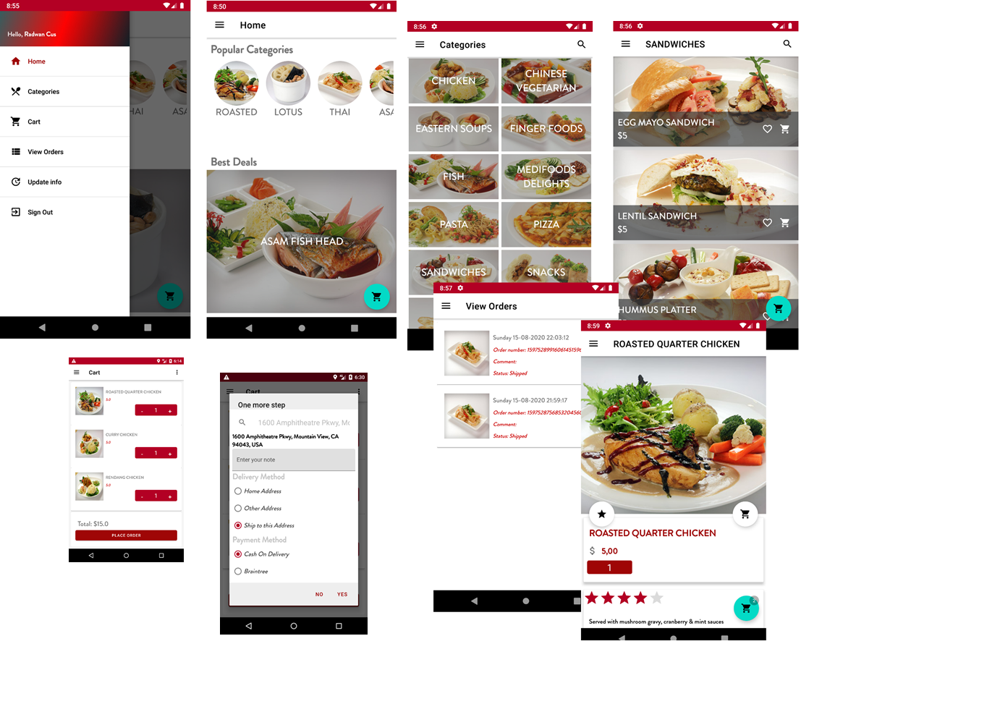
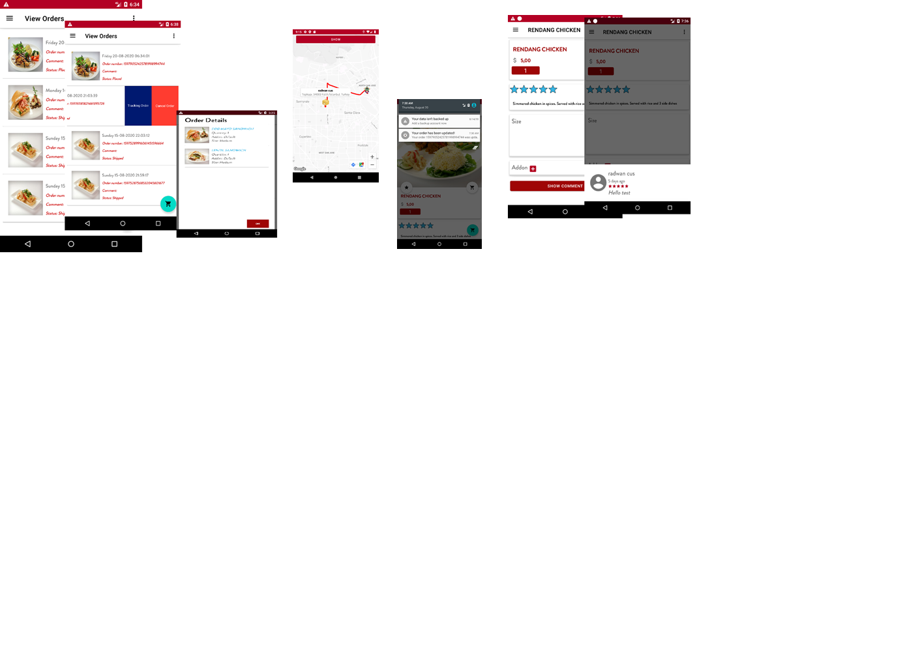
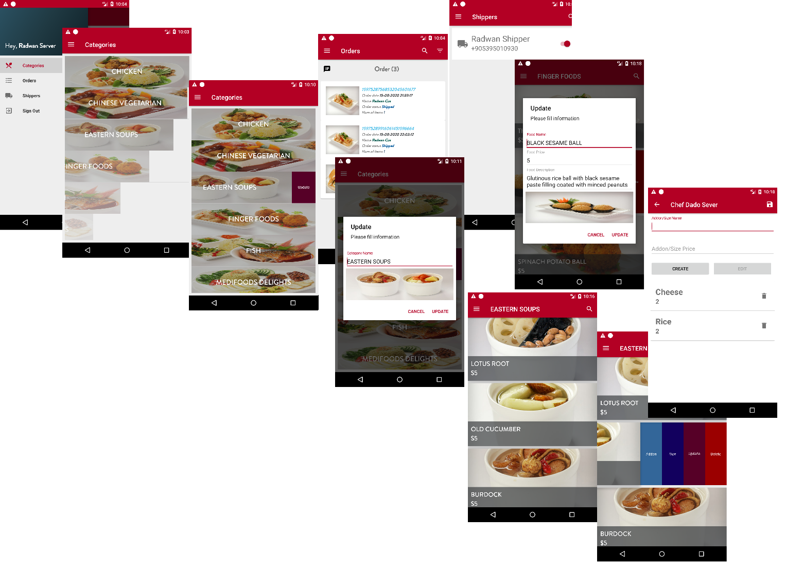
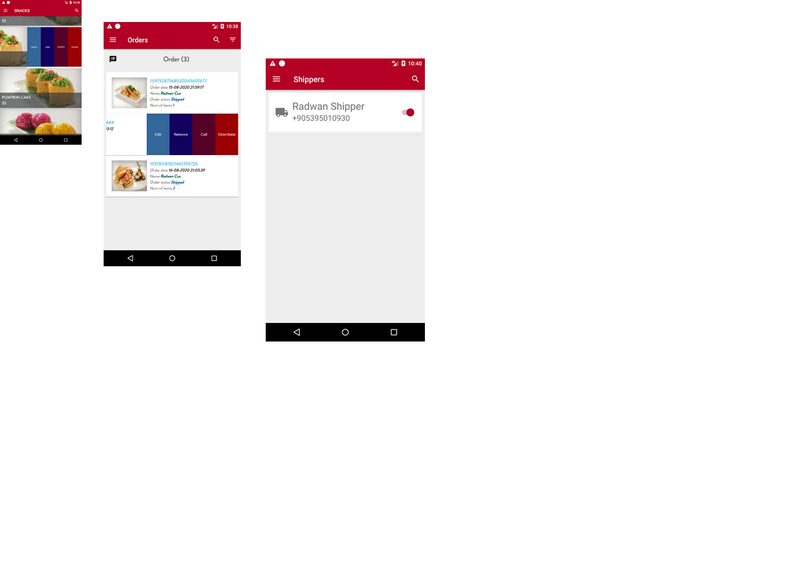
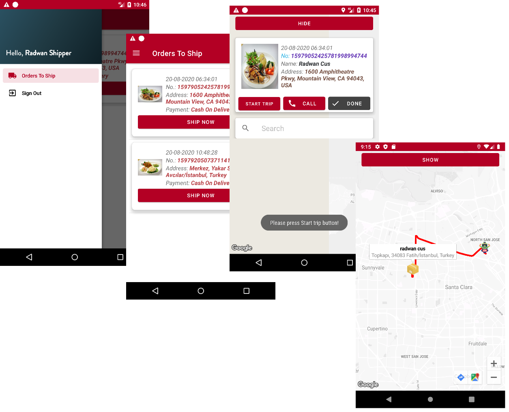
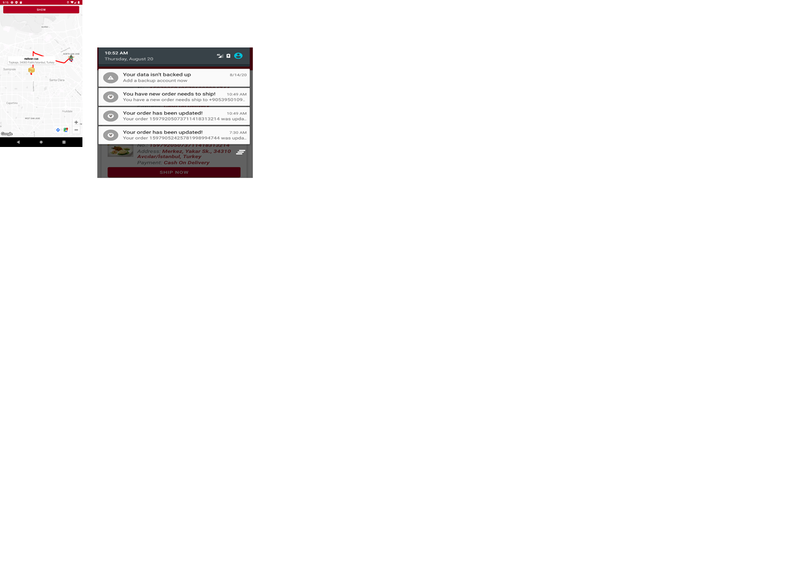

# E-Commerce-Resturant-Android-Java-Apps

In today's internet era, mobile phones are an integral part of almost every single person.
And the global economic trend is focusing on the field of applications for smartphones.

From the fact that I want to improve myself and advance my career on cryptology and
machine learning and apply this knowledge on a tangible thing as such smartphones
engineering and with a step to understand this sector more I decided to make an
Android app that have a tangible value and common application such as E-shops.

With the trend aiming to improve and increase the well-being of the person and
increase the sales capacity of the store owners, and , out of these came the idea to
design a smartphone application that aims to create a sales line between customers and
restaurants, that have Additional features that make me understand the concepts of
Android system more deeply and in an applying way as a first step in this major, I
decided to build an E-Restaurant android application for ordering foods.

In my application I tried to learn more about Android concepts and how to handle
different common used scenarios, the project consists of three combined applications,
to explain briefly, we have a "Customer" who wants to buy a food and this lead us to
the "Restaurant" who needs to make that food to this customer and the bridge between
this two is the "Delivery guy". Everyone from this three needs to handle a certain work
to make the final service available.

To convert this to a software solution, how it should be? Yes, three separated
applications.

A custom application for the Restaurant,
A custom application for the customer,
And a custom application for the delivery guy,

Those three apps with its different features such as maps, payment methods,
notification handling, databases and User Interface friendly using; will exchange
information between each other and work together to provide a full-scale restaurant
service operation.

The applications main features are as following:

The apps works on Android system version 5 and higher.

Apps' best features:

* 2 type of payment methods provided, Cash on delivery and credit card using third party API Braintree payment.

* A friendly User interface.

* Order tracking on Google map.

* Notification System.

* And many more basic e-commerce features you can discover while using it!

You can watch the features here as well:

<iframe width="560" height="315" src="https://www.youtube.com/embed/2SWNPbWfEtY" frameborder="0" allow="accelerometer; autoplay; clipboard-write; encrypted-media; gyroscope; picture-in-picture" allowfullscreen></iframe>

Customer Application Screenshots

Server Application Screenshots

Delivery Application Screenshots

